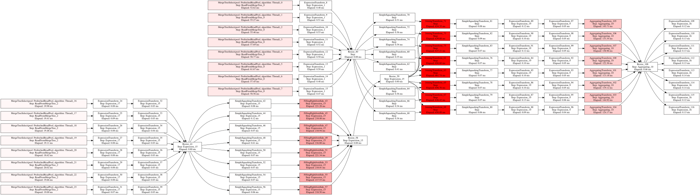

### Usage

``` sh
❯ ./explain.py --help
usage: explain.py [-h] [--host HOST] [--secure] [--password PASSWORD] [--cluster CLUSTER] sql_query

Execute ClickHouse query with profiling and generate an enriched DOT graph. Distributed queries are not really supported.

positional arguments:
  sql_query            SQL query to profile

options:
  -h, --help           show this help message and exit
  --host HOST          ClickHouse server host (default: localhost)
  --secure             Use secure connection to ClickHouse
  --password PASSWORD  ClickHouse server password (default: empty)
  --cluster CLUSTER    ClickHouse cluster name
```

### Example

Command:

``` sh
./explain.py 'with t as (select CounterID, WatchID from hits_s3 WHERE CounterID < 8888 and WatchID > 30001) select WatchID, sum(CounterID) from hits_s3 lhs inner join t rhs using (WatchID) group by WatchID settings max_threads=8' | dot -T svg > query_heatmap.svg
```

Output:


